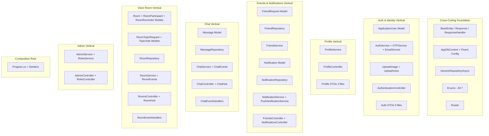

# 🏗️ Cocorra API — Granular Master Execution Plan
## Feature-Driven (Vertical Slicing) Code Review & QA

> **Methodology**: Each phase traces a complete vertical slice from **Database Schema → Repository → Service → MediatR Event → Controller/Hub**, grouping tightly coupled components to maintain full context without exceeding review depth limits.

---

## 📊 System Dependency Graph (High-Level)

---

## 📅 Phase Breakdown (16 Phases)

---

### Phase 1: 🧱 Core Foundation — BaseEntity, Response Wrapper & Shared Enums
> *The DNA of every entity and every API response. Mistakes here propagate everywhere.*

| # | File | Layer |
|---|------|-------|
| 1 | [BaseEntity.cs](file:///d:/Freelance/Cocorra/Cocorra.DAL/Models/BaseEntity.cs) | DAL/Models |
| 2 | [Response.cs](file:///d:/Freelance/Cocorra/Cocorra.BLL/Base/Response.cs) | BLL/Base |
| 3 | [ResponseHandler.cs](file:///d:/Freelance/Cocorra/Cocorra.BLL/Base/ResponseHandler.cs) | BLL/Base |
| 4 | [UserStatus.cs](file:///d:/Freelance/Cocorra/Cocorra.DAL/Enums/UserStatus.cs) | DAL/Enums |
| 5 | [FriendRequestStatus.cs](file:///d:/Freelance/Cocorra/Cocorra.DAL/Enums/FriendRequestStatus.cs) | DAL/Enums |
| 6 | [NotificationType.cs](file:///d:/Freelance/Cocorra/Cocorra.DAL/Enums/NotificationType.cs) | DAL/Enums |
| 7 | [ParticipantStatus.cs](file:///d:/Freelance/Cocorra/Cocorra.DAL/Enums/ParticipantStatus.cs) | DAL/Enums |
| 8 | [RequestStatus.cs](file:///d:/Freelance/Cocorra/Cocorra.DAL/Enums/RequestStatus.cs) | DAL/Enums |
| 9 | [RoomSelectionMode.cs](file:///d:/Freelance/Cocorra/Cocorra.DAL/Enums/RoomSelectionMode.cs) | DAL/Enums |
| 10 | [RoomStatus.cs](file:///d:/Freelance/Cocorra/Cocorra.DAL/Enums/RoomStatus.cs) | DAL/Enums |
| 11 | [global.cs](file:///d:/Freelance/Cocorra/Cocorra.DAL/global.cs) | DAL |

**Focus**: Naming conventions, typos (`UpdateAt` vs `UpdatedAt`), enum completeness, namespace consistency, `DateTime.UtcNow` in property initializers trap.

---

### Phase 2: 🗄️ Database Schema & Relationships — AppDbContext
> *The single source of truth for all relationships, indexes, and cascade behaviors.*

| # | File | Layer |
|---|------|-------|
| 1 | [AppDbContext.cs](file:///d:/Freelance/Cocorra/Cocorra.DAL/Data/AppDbContext.cs) | DAL/Data |
| 2 | [ApplicationUser.cs](file:///d:/Freelance/Cocorra/Cocorra.DAL/Models/ApplicationUser.cs) | DAL/Models |

**Focus**: Fluent API correctness, cascade delete safety (orphan risk), missing indexes, Identity configuration, `DateTime.UtcNow` traps in model defaults, relationship symmetry.

---

### Phase 3: 🧬 Generic Repository Pattern
> *Every specific repository inherits from this. A flaw here = system-wide flaw.*

| # | File | Layer |
|---|------|-------|
| 1 | [IGenericRepositoryAsync.cs](file:///d:/Freelance/Cocorra/Cocorra.DAL/Repository/GenericRepository/IGenericRepositoryAsync.cs) | DAL/Repository |
| 2 | [GenericRepositoryAsync.cs](file:///d:/Freelance/Cocorra/Cocorra.DAL/Repository/GenericRepository/GenericRepositoryAsync.cs) | DAL/Repository |

**Focus**: Auto-save after every operation (anti-pattern?), transaction management, `where T : BaseEntity` constraint implications, soft-delete references in comments vs actual behavior, `FindAsync` vs `FirstOrDefaultAsync` trade-offs.

---

### Phase 4: 📂 File Upload Services — Image & Voice
> *Shared cross-cutting infrastructure used by Auth and Profile.*

| # | File | Layer |
|---|------|-------|
| 1 | [IUploadImage.cs](file:///d:/Freelance/Cocorra/Cocorra.BLL/Services/UploadService/IUploadImage.cs) | BLL/Services |
| 2 | [UploadImage.cs](file:///d:/Freelance/Cocorra/Cocorra.BLL/Services/UploadService/UploadImage.cs) | BLL/Services |
| 3 | [IUploadVoice.cs](file:///d:/Freelance/Cocorra/Cocorra.BLL/Services/UploadService/IUploadVoice.cs) | BLL/Services |
| 4 | [UploadVoice.cs](file:///d:/Freelance/Cocorra/Cocorra.BLL/Services/UploadService/UploadVoice.cs) | BLL/Services |

**Focus**: Path traversal attacks, file type validation, size limits, race conditions on filename collision, orphaned file cleanup, synchronous `DeleteImage`.

---

### Phase 5: 📧 Email & OTP Infrastructure
> *Transactional email delivery and OTP lifecycle — if this leaks, accounts are compromised.*

| # | File | Layer |
|---|------|-------|
| 1 | [IEmailService.cs](file:///d:/Freelance/Cocorra/Cocorra.BLL/Services/Email/IEmailService.cs) | BLL/Services |
| 2 | [EmailService.cs](file:///d:/Freelance/Cocorra/Cocorra.BLL/Services/Email/EmailService.cs) | BLL/Services |
| 3 | [IOTPService.cs](file:///d:/Freelance/Cocorra/Cocorra.BLL/Services/OTPService/IOTPService.cs) | BLL/Services |
| 4 | [OTPService.cs](file:///d:/Freelance/Cocorra/Cocorra.BLL/Services/OTPService/OTPService.cs) | BLL/Services |

**Focus**: SMTP connection leaks, OTP brute-force protection, token provider purpose mismatch, duplicate HTML template code (DRY violation), user enumeration via error messages.

---

### Phase 6: 🔐 Authentication Vertical — Registration & Login Flow
> *Full slice: DTOs → AuthService → AuthenticationController*

| # | File | Layer |
|---|------|-------|
| 1 | [RegisterDto.cs](file:///d:/Freelance/Cocorra/Cocorra.DAL/DTOS/Auth/RegisterDto.cs) | DAL/DTOs |
| 2 | [LoginDto.cs](file:///d:/Freelance/Cocorra/Cocorra.DAL/DTOS/Auth/LoginDto.cs) | DAL/DTOs |
| 3 | [AuthModel.cs](file:///d:/Freelance/Cocorra/Cocorra.DAL/DTOS/Auth/AuthModel.cs) | DAL/DTOs |
| 4 | [ForgotPasswordDto.cs](file:///d:/Freelance/Cocorra/Cocorra.DAL/DTOS/Auth/ForgotPasswordDto.cs) | DAL/DTOs |
| 5 | [SubmitMbtiDto.cs](file:///d:/Freelance/Cocorra/Cocorra.DAL/DTOS/Auth/SubmitMbtiDto.cs) | DAL/DTOs |
| 6 | [IAuthServices.cs](file:///d:/Freelance/Cocorra/Cocorra.BLL/Services/AuthService/IAuthServices.cs) | BLL/Services |
| 7 | [AuthServices.cs](file:///d:/Freelance/Cocorra/Cocorra.BLL/Services/AuthService/AuthServices.cs) | BLL/Services |
| 8 | [AuthenticationController.cs](file:///d:/Freelance/Cocorra/Cocorra.API/Controllers/AuthenticationController.cs) | API/Controllers |

**Focus**: JWT 15-day expiration, missing `[Authorize]` on SubmitMbti, `ForgotPassword` generates token but never sends it, `profilePicture` claim in JWT (stale data), registration transaction with file rollback, exception message leakage, `AppDbContext` direct usage in service.

---

### Phase 7: 👤 Profile Vertical — View & Update Profile
> *Full slice: Profile DTOs → ProfileService → ProfileController*

| # | File | Layer |
|---|------|-------|
| 1 | [MyProfileDto.cs](file:///d:/Freelance/Cocorra/Cocorra.DAL/DTOS/ProfileDto/MyProfileDto.cs) | DAL/DTOs |
| 2 | [PublicProfileDto.cs](file:///d:/Freelance/Cocorra/Cocorra.DAL/DTOS/ProfileDto/PublicProfileDto.cs) | DAL/DTOs |
| 3 | [UpdateProfileDto.cs](file:///d:/Freelance/Cocorra/Cocorra.DAL/DTOS/ProfileDto/UpdateProfileDto.cs) | DAL/DTOs |
| 4 | [IProfileService.cs](file:///d:/Freelance/Cocorra/Cocorra.BLL/Services/ProfileService/IProfileService.cs) | BLL/Services |
| 5 | [ProfileService.cs](file:///d:/Freelance/Cocorra/Cocorra.BLL/Services/ProfileService/ProfileService.cs) | BLL/Services |
| 6 | [ProfileController.cs](file:///d:/Freelance/Cocorra/Cocorra.API/Controllers/ProfileController.cs) | API/Controllers |

**Focus**: Double DB roundtrip in `UpdateProfileAsync` (calls `GetMyProfileAsync` again), profile picture upload orphan risk, missing validation on `UpdateProfileDto`, no privacy controls on public profile data exposure.

---

### Phase 8: 🤝 Friend Request Model & Repository
> *Data access layer for the social graph — foundation for Chat and Notifications.*

| # | File | Layer |
|---|------|-------|
| 1 | [FriendRequest.cs](file:///d:/Freelance/Cocorra/Cocorra.DAL/Models/FriendRequest.cs) | DAL/Models |
| 2 | [IFriendRepository.cs](file:///d:/Freelance/Cocorra/Cocorra.DAL/Repository/FriendRepository/IFriendRepository.cs) | DAL/Repository |
| 3 | [FriendRepository.cs](file:///d:/Freelance/Cocorra/Cocorra.DAL/Repository/FriendRepository/FriendRepository.cs) | DAL/Repository |

**Focus**: `GetAcceptedFriendsAsync` loads ALL friendships with full user entities (N+1 risk), rejected requests are never cleared (data growth), missing index utilization, bi-directional query logic correctness.

---

### Phase 9: 🤝 Friend Service & Controller — Social Graph Business Logic
> *Full vertical: FriendService → FriendsController, with Notification side-effects.*

| # | File | Layer |
|---|------|-------|
| 1 | [UserSearchDto.cs](file:///d:/Freelance/Cocorra/Cocorra.DAL/DTOS/FriendDto/UserSearchDto.cs) | DAL/DTOs |
| 2 | [SendRequestDto.cs](file:///d:/Freelance/Cocorra/Cocorra.DAL/DTOS/FriendDto/SendRequestDto.cs) | DAL/DTOs |
| 3 | [IFriendService.cs](file:///d:/Freelance/Cocorra/Cocorra.BLL/Services/FriendService/IFriendService.cs) | BLL/Services |
| 4 | [FriendService.cs](file:///d:/Freelance/Cocorra/Cocorra.BLL/Services/FriendService/FriendService.cs) | BLL/Services |
| 5 | [FriendsController.cs](file:///d:/Freelance/Cocorra/Cocorra.API/Controllers/FriendsController.cs) | API/Controllers |

**Focus**: Race condition on concurrent friend requests, re-sending after rejection (rejected requests block new ones via unique index), `RemoveFriendOrCancelRequest` deletes notification from NoTracking query (will crash), notification creation not in same transaction as friend request, fire-and-forget push notification exceptions silently lost.

---

### Phase 10: 🔔 Notification Vertical — Model, Repository, Service & Controller
> *A shared resource consumed by Friends, Chat, and Rooms modules.*

| # | File | Layer |
|---|------|-------|
| 1 | [Notification.cs](file:///d:/Freelance/Cocorra/Cocorra.DAL/Models/Notification.cs) | DAL/Models |
| 2 | [NotificationResponseDto.cs](file:///d:/Freelance/Cocorra/Cocorra.DAL/DTOS/NotificationDto/NotificationResponseDto.cs) | DAL/DTOs |
| 3 | [INotificationRepository.cs](file:///d:/Freelance/Cocorra/Cocorra.DAL/Repository/NotificationRepository/INotificationRepository.cs) | DAL/Repository |
| 4 | [NotificationRepository.cs](file:///d:/Freelance/Cocorra/Cocorra.DAL/Repository/NotificationRepository/NotificationRepository.cs) | DAL/Repository |
| 5 | [INotificationService.cs](file:///d:/Freelance/Cocorra/Cocorra.BLL/Services/NotificationService/INotificationService.cs) | BLL/Services |
| 6 | [NotificationService.cs](file:///d:/Freelance/Cocorra/Cocorra.BLL/Services/NotificationService/NotificationService.cs) | BLL/Services |
| 7 | [IPushNotificationService.cs](file:///d:/Freelance/Cocorra/Cocorra.BLL/Services/NotificationService/IPushNotificationService.cs) | BLL/Services |
| 8 | [PushNotificationService.cs](file:///d:/Freelance/Cocorra/Cocorra.BLL/Services/NotificationService/PushNotificationService.cs) | BLL/Services |
| 9 | [NotificationsController.cs](file:///d:/Freelance/Cocorra/Cocorra.API/Controllers/NotificationsController.cs) | API/Controllers |

**Focus**: No pagination on `GetMyNotifications` (will degrade at scale), `MarkNotificationAsReadAsync` does GetById then Update (double roundtrip), PushNotificationService is a no-op stub (entire FCM logic commented out), missing `MarkAllAsRead` bulk operation, no notification cleanup/TTL.

---

### Phase 11: 💬 Chat Model & Repository — Message Data Access
> *The heaviest data access path — message storage, pagination, summaries, and read receipts.*

| # | File | Layer |
|---|------|-------|
| 1 | [Message.cs](file:///d:/Freelance/Cocorra/Cocorra.DAL/Models/Message.cs) | DAL/Models |
| 2 | [ChatFriendDto.cs](file:///d:/Freelance/Cocorra/Cocorra.DAL/DTOS/ChatDto/ChatFriendDto.cs) | DAL/DTOs |
| 3 | [MessageDto.cs](file:///d:/Freelance/Cocorra/Cocorra.DAL/DTOS/ChatDto/MessageDto.cs) | DAL/DTOs |
| 4 | [IMessageRepository.cs](file:///d:/Freelance/Cocorra/Cocorra.DAL/Repository/MessageRepository/IMessageRepository.cs) | DAL/Repository |
| 5 | [MessageRepository.cs](file:///d:/Freelance/Cocorra/Cocorra.DAL/Repository/MessageRepository/MessageRepository.cs) | DAL/Repository |

**Focus**: `MarkMessagesAsReadAsync` loads ALL unread into memory then UpdateRange (memory bomb), `GetFriendsChatSummariesAsync` GroupBy with FirstOrDefault may fail in EF Core SQL translation, `GetChatHistoryAsync` does double-sort (DB then in-memory), DTO in DAL layer (architecture violation), composite index usage.

---

### Phase 12: 💬 Chat Vertical — Service, Controller, Hub & Events
> *Real-time messaging: Service → ChatController → ChatHub → MediatR Event → ChatEventHandler*

| # | File | Layer |
|---|------|-------|
| 1 | [IChatService.cs](file:///d:/Freelance/Cocorra/Cocorra.BLL/Services/ChatService/IChatService.cs) | BLL/Services |
| 2 | [ChatService.cs](file:///d:/Freelance/Cocorra/Cocorra.BLL/Services/ChatService/ChatService.cs) | BLL/Services |
| 3 | [ChatEvents.cs](file:///d:/Freelance/Cocorra/Cocorra.BLL/Services/Events/ChatEvents.cs) | BLL/Events |
| 4 | [ChatController.cs](file:///d:/Freelance/Cocorra/Cocorra.API/Controllers/ChatController.cs) | API/Controllers |
| 5 | [ChatHub.cs](file:///d:/Freelance/Cocorra/Cocorra.API/Hubs/ChatHub.cs) | API/Hubs |
| 6 | [ChatEventHandlers.cs](file:///d:/Freelance/Cocorra/Cocorra.API/EventHandlers/ChatEventHandlers.cs) | API/EventHandlers |

**Focus**: `SaveMessageAsync` fire-and-forget push notification (`_ =`) loses exceptions, no message length validation in Hub, `ChatHub.SendMessage` does NOT check if receiver is blocked/non-friend at Hub level (relies on service), no rate limiting, MediatR event for read receipts but controller also has REST endpoint for same action (dual path risk), no concurrency guards.

---

### Phase 13: 🎙️ Voice Room Models & Repository
> *Complex domain: Room + RoomParticipant + RoomReminder + TopicRequest + TopicVote with composite keys.*

| # | File | Layer |
|---|------|-------|
| 1 | [Room.cs](file:///d:/Freelance/Cocorra/Cocorra.DAL/Models/Room.cs) | DAL/Models |
| 2 | [RoomParticipant.cs](file:///d:/Freelance/Cocorra/Cocorra.DAL/Models/RoomParticipant.cs) | DAL/Models |
| 3 | [RoomReminder.cs](file:///d:/Freelance/Cocorra/Cocorra.DAL/Models/RoomReminder.cs) | DAL/Models |
| 4 | [RoomTopicRequest.cs](file:///d:/Freelance/Cocorra/Cocorra.DAL/Models/RoomTopicRequest.cs) | DAL/Models |
| 5 | [TopicVote.cs](file:///d:/Freelance/Cocorra/Cocorra.DAL/Models/TopicVote.cs) | DAL/Models |
| 6 | [IRoomRepository.cs](file:///d:/Freelance/Cocorra/Cocorra.DAL/Repository/RoomRepository/IRoomRepository.cs) | DAL/Repository |
| 7 | [RoomRepository.cs](file:///d:/Freelance/Cocorra/Cocorra.DAL/Repository/RoomRepository/RoomRepository.cs) | DAL/Repository |

**Focus**: `RoomParticipant` doesn't inherit `BaseEntity` (no `Id`, no `CreatedAt`), `await Task.CompletedTask` fake-async pattern (code smell), `RemoveRemindersAsync` doesn't actually save, `AddParticipantAsync`/`UpdateParticipantAsync` don't save, inconsistent save responsibility (sometimes repo saves, sometimes caller must call `SaveChangesAsync`), `AddNotificationsAsync` belongs in `NotificationRepository` not `RoomRepository` (SRP violation), `GetActiveRoomsAsync` doesn't eager-load Host.

---

### Phase 14: 🎙️ Voice Room Service — Business Logic (REST Operations)
> *Full slice: Room DTOs → RoomService → RoomsController*

| # | File | Layer |
|---|------|-------|
| 1 | [CreateRoomDto.cs](file:///d:/Freelance/Cocorra/Cocorra.DAL/DTOS/RoomDto/CreateRoomDto.cs) | DAL/DTOs |
| 2 | [RoomStateDto.cs](file:///d:/Freelance/Cocorra/Cocorra.DAL/DTOS/RoomDto/RoomStateDto.cs) | DAL/DTOs |
| 3 | [RoomSummaryDto.cs](file:///d:/Freelance/Cocorra/Cocorra.DAL/DTOS/RoomDto/RoomSummaryDto.cs) | DAL/DTOs |
| 4 | [ParticipantStateDto.cs](file:///d:/Freelance/Cocorra/Cocorra.DAL/DTOS/RoomDto/ParticipantStateDto.cs) | DAL/DTOs |
| 5 | [RoomListDto.cs](file:///d:/Freelance/Cocorra/Cocorra.DAL/DTOS/RoomDto/RoomListDto.cs) | DAL/DTOs |
| 6 | [IRoomService.cs](file:///d:/Freelance/Cocorra/Cocorra.BLL/Services/RoomService/IRoomService.cs) | BLL/Services |
| 7 | [RoomService.cs](file:///d:/Freelance/Cocorra/Cocorra.BLL/Services/RoomService/RoomService.cs) | BLL/Services |
| 8 | [RoomEvents.cs](file:///d:/Freelance/Cocorra/Cocorra.BLL/Services/Events/RoomEvents.cs) | BLL/Events |
| 9 | [RoomEventHandlers.cs](file:///d:/Freelance/Cocorra/Cocorra.API/EventHandlers/RoomEventHandlers.cs) | API/EventHandlers |
| 10 | [RoomsController.cs](file:///d:/Freelance/Cocorra/Cocorra.API/Controllers/RoomsController.cs) | API/Controllers |

**Focus**: **CRITICAL N+1** in `GetRoomsFeedAsync` (loops rooms, queries participants + reminders per room), `JoinRoomAsync` loads all participants to count active (no DB-side `COUNT`), race condition on concurrent joins (capacity bypass), `StartScheduledRoomAsync` double-save pattern (UpdateAsync saves, then SaveChangesAsync again), `GetRoomsFeedAsync` accesses `room.Host!` but Host is not eager-loaded (NullRef in production), `NotificationType.RoomReminder` reused for unrelated notification types (semantic ambiguity).

---

### Phase 15: 🎙️ Voice Room Hub — Real-Time WebSocket Operations
> *The most complex SignalR hub: stage management, mic control, time tracking, kick.*

| # | File | Layer |
|---|------|-------|
| 1 | [RoomHub.cs](file:///d:/Freelance/Cocorra/Cocorra.API/Hubs/RoomHub.cs) | API/Hubs |

**Focus**: Hub directly uses `IRoomRepository` (bypasses BLL entirely — **major architecture violation**), `Guid.Parse` without TryParse (throws on bad input), no cleanup on `OnDisconnectedAsync` (user stays "Active" if browser crashes), race conditions on concurrent `ToggleMic`/`ApproveToStage` calls (double-spend speaker slots), spoken-time tracking precision issues (double floating point drift), host can kick themselves, no validation that host is still connected, methods silently `return` instead of throwing errors (hides bugs from client).

---

### Phase 16: 🛡️ Admin & Roles Vertical + Composition Root (Program.cs)
> *Admin panel endpoints, role management, DI registration, seeders, and middleware pipeline.*

| # | File | Layer |
|---|------|-------|
| 1 | [UserDto.cs](file:///d:/Freelance/Cocorra/Cocorra.DAL/DTOS/AdminDto/UserDto.cs) | DAL/DTOs |
| 2 | [ChangeStatusDto.cs](file:///d:/Freelance/Cocorra/Cocorra.DAL/DTOS/AdminDto/ChangeStatusDto.cs) | DAL/DTOs |
| 3 | [DashboardStatsDto.cs](file:///d:/Freelance/Cocorra/Cocorra.DAL/DTOS/AdminDto/DashboardStatsDto.cs) | DAL/DTOs |
| 4 | [PasswordResetDto.cs](file:///d:/Freelance/Cocorra/Cocorra.DAL/DTOS/AdminDto/PasswordResetDto.cs) | DAL/DTOs |
| 5 | [RoleDto.cs](file:///d:/Freelance/Cocorra/Cocorra.DAL/DTOS/Role/RoleDto.cs) | DAL/DTOs |
| 6 | [ManageUserRolesDto.cs](file:///d:/Freelance/Cocorra/Cocorra.DAL/DTOS/Role/ManageUserRolesDto.cs) | DAL/DTOs |
| 7 | [UpdateRoleDto.cs](file:///d:/Freelance/Cocorra/Cocorra.DAL/DTOS/Role/UpdateRoleDto.cs) | DAL/DTOs |
| 8 | [IAdminService.cs](file:///d:/Freelance/Cocorra/Cocorra.BLL/Services/AdminService/IAdminService.cs) | BLL/Services |
| 9 | [AdminService.cs](file:///d:/Freelance/Cocorra/Cocorra.BLL/Services/AdminService/AdminService.cs) | BLL/Services |
| 10 | [IRolesService.cs](file:///d:/Freelance/Cocorra/Cocorra.BLL/Services/RolesService/IRolesService.cs) | BLL/Services |
| 11 | [RolesService.cs](file:///d:/Freelance/Cocorra/Cocorra.BLL/Services/RolesService/RolesService.cs) | BLL/Services |
| 12 | [AdminController.cs](file:///d:/Freelance/Cocorra/Cocorra.API/Controllers/AdminController.cs) | API/Controllers |
| 13 | [RolesController.cs](file:///d:/Freelance/Cocorra/Cocorra.API/Controllers/RolesController.cs) | API/Controllers |
| 14 | [Router.cs](file:///d:/Freelance/Cocorra/Cocorra.DAL/AppMetaData/Router.cs) | DAL/AppMetaData |
| 15 | [Program.cs](file:///d:/Freelance/Cocorra/Cocorra.API/Program.cs) | API |
| 16 | [RoleSeeder.cs](file:///d:/Freelance/Cocorra/Cocorra.DAL/Data/RoleSeeder.cs) | DAL/Data |
| 17 | [IdentitySeeder.cs](file:///d:/Freelance/Cocorra/Cocorra.API/Seeder/IdentitySeeder.cs) | API/Seeder |

**Focus**: **`[Authorize(Roles = "Admin")]` is COMMENTED OUT on AdminController** (any user can access admin endpoints!), `GetDashboardStatsAsync` fires 5 separate COUNT queries (should be single query), `CORS` allows any origin with credentials (security risk), password policy is extremely weak, `Router.RoomRouting.Feed` missing `/` prefix, `toggleReminder` route missing `/`, no global exception handler, no rate limiting middleware, no request logging.

---

## 📈 Phase Metrics Summary

| Phase | Files | Risk Level | Primary Concern |
|-------|-------|------------|-----------------|
| 1 | 11 | 🟡 Medium | Naming/type safety propagation |
| 2 | 2 | 🔴 High | Cascade deletes, missing indexes |
| 3 | 2 | 🔴 High | Auto-save pattern, transaction safety |
| 4 | 4 | 🟠 High | Path traversal, file validation |
| 5 | 4 | 🔴 Critical | OTP brute-force, token mismatch |
| 6 | 8 | 🔴 Critical | Auth bypass, JWT flaws, dead code |
| 7 | 6 | 🟡 Medium | Double roundtrip, validation gaps |
| 8 | 3 | 🟠 High | N+1 on friend lists |
| 9 | 5 | 🔴 High | Race conditions, cross-tracking bug |
| 10 | 9 | 🟡 Medium | No pagination, stub push service |
| 11 | 5 | 🔴 High | Memory bomb on mark-read, EF translation |
| 12 | 6 | 🔴 High | Fire-forget exceptions, dual paths |
| 13 | 7 | 🟠 High | Inconsistent save, SRP violations |
| 14 | 10 | 🔴 Critical | N+1 feed query, NullRef, capacity race |
| 15 | 1 | 🔴 Critical | Architecture violation, no disconnect cleanup |
| 16 | 17 | 🔴 Critical | Admin auth disabled, weak CORS, no rate limit |

---

> [!IMPORTANT]
> **Execution Protocol**: Each phase review will re-read the actual source files and deliver findings in the exact 4-section format (🔍 Architecture, ⚡ Performance & Security, 🧪 QA Edge Cases, 🛠️ Fixes). Say **"Start Phase N"** to begin any phase.
