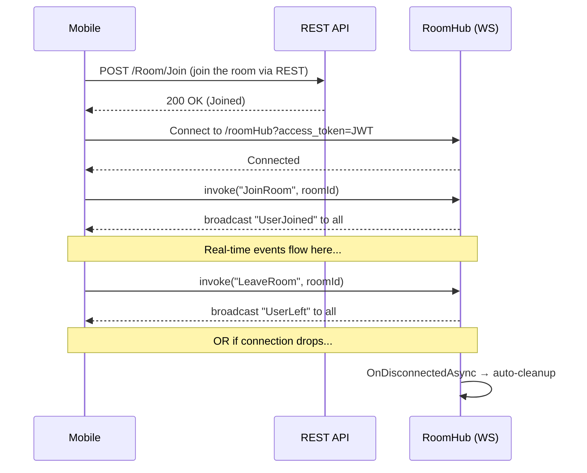

# 📱 Cocorra API — Mobile Developer Integration Guide
## Chat & Voice Rooms — Complete Reference

> **Base URL:** `https://your-server.com` (replace with your staging/production URL)
> **Auth:** All endpoints (except Login/Register/ForgotPassword/ConfirmEmail/ResendOtp/ResetPassword) require a JWT Bearer token in the `Authorization` header.

---

## Table of Contents

1. [Authentication Quick Reference](#1-authentication-quick-reference)
2. [Chat Module — REST Endpoints](#2-chat-module--rest-endpoints)
3. [Chat Module — SignalR Hub (`/chatHub`)](#3-chat-module--signalr-hub-chathub)
4. [Rooms Module — REST Endpoints](#4-rooms-module--rest-endpoints)
5. [Rooms Module — SignalR Hub (`/roomHub`)](#5-rooms-module--signalr-hub-roomhub)
6. [Common Response Envelope](#6-common-response-envelope)
7. [Error Handling Reference](#7-error-handling-reference)

---

## 1. Authentication Quick Reference

### Base Path: `Api/V1/Authentication`

| Method | Endpoint | Auth Required | Body Type |
|--------|----------|---------------|-----------|
| `POST` | `/Register` | ❌ | `multipart/form-data` |
| `POST` | `/Login` | ❌ | `application/json` |
| `GET` | `/ConfirmEmail?email=...&otpCode=...` | ❌ | Query Params |
| `POST` | `/ResendOtp` | ❌ | `application/json` (string email) |
| `POST` | `/ForgotPassword` | ❌ | `application/json` |
| `POST` | `/ResetPassword` | ❌ | `application/json` |
| `POST` | `/SubmitMbti` | ✅ | `application/json` |
| `PUT` | `/UpdateFcmToken` | ✅ | `application/json` (string) |
| `POST` | `/ReRecordVoice` | ✅ | `multipart/form-data` |
| `PUT` | `/UpdatePassword` | ✅ | `application/json` |

### Login Response DTO (`AuthModel`)

```json
{
  "data": {
    "email": "user@example.com",
    "username": "user@example.com",
    "token": "eyJhbGciOiJIUzI1NiIs...",
    "expiresOn": "2026-04-01T19:00:00Z",
    "isAuthenticated": true,
    "roles": ["User"]
  },
  "succeeded": true,
  "message": null,
  "statusCode": 200
}
```

> [!IMPORTANT]
> **Login Status Rules:** The API will reject login with a descriptive message for these statuses:
> - `Pending` → "Your account is still pending approval."
> - `Rejected` → "Your account has been rejected."
> - `Banned` → "Your account has been banned."
> - `ReRecord` → "Your voice verification was not accepted. Please re-record and resubmit."
> Only `Active` status allows login.

### Re-Record Voice (for users with `ReRecord` status)

```
POST Api/V1/Authentication/ReRecordVoice
Content-Type: multipart/form-data
Authorization: Bearer <token>

Form Data:
  voiceFile: <audio file (.m4a, .aac, .wav, etc.)>
```

**Response:**
```json
{
  "data": "Voice re-recorded successfully. Your account is now pending review.",
  "succeeded": true,
  "statusCode": 200
}
```

### Update Password (authenticated users)

```
PUT Api/V1/Authentication/UpdatePassword
Content-Type: application/json
Authorization: Bearer <token>

{
  "currentPassword": "OldP@ssword1",
  "newPassword": "NewP@ssword2"
}
```

### Forgot Password → Reset Password Flow

**Step 1:** Call `POST /ForgotPassword` with `{ "email": "user@example.com" }` → user receives OTP via email.

**Step 2:** Call `POST /ResetPassword` with:
```json
{
  "email": "user@example.com",
  "otpCode": "123456",
  "newPassword": "NewSecureP@ss1"
}
```

---

## 2. Chat Module — REST Endpoints

### Base Path: `api/Chat`

> [!NOTE]
> All Chat endpoints require `Authorization: Bearer <JWT>` header.

---

### 2.1 Get Chat Friends List (Inbox)

```
GET api/Chat/friends-list?pageNumber=1&pageSize=20
Authorization: Bearer <token>
```

**Query Parameters:**

| Param | Type | Default | Max | Description |
|-------|------|---------|-----|-------------|
| `pageNumber` | int | 1 | — | Page number (1-indexed) |
| `pageSize` | int | 20 | 100 | Items per page |

**Response DTO: `ChatFriendDto[]`**

```json
{
  "data": [
    {
      "friendId": "a1b2c3d4-...",
      "fullName": "Ahmed Hassan",
      "profilePicturePath": "uploads/images/abc123.jpg",
      "lastMessage": "Hey, how are you?",
      "lastMessageDate": "2026-03-31T18:45:00Z",
      "unreadCount": 3
    }
  ],
  "succeeded": true,
  "statusCode": 200
}
```

> [!TIP]
> - `profilePicturePath` will be an empty string `""` if the user has no profile picture (never `null`).
> - `lastMessage` will be `""` if no messages exist yet (never `null`).
> - `lastMessageDate` will be `null` if no messages exist. **Do not** attempt to parse it if null.
> - Sort your inbox UI by `lastMessageDate` descending (most recent conversations first). The API already returns them sorted.

---

### 2.2 Get Chat History (Conversation Messages)

```
GET api/Chat/history/{friendId}?pageNumber=1&pageSize=50
Authorization: Bearer <token>
```

**Path Parameters:**

| Param | Type | Description |
|-------|------|-------------|
| `friendId` | Guid | The friend's UserId |

**Query Parameters:**

| Param | Type | Default | Max | Description |
|-------|------|---------|-----|-------------|
| `pageNumber` | int | 1 | — | Page number (1-indexed, page 1 = newest) |
| `pageSize` | int | 50 | 100 | Messages per page |

**Response DTO: `MessageDto[]`**

```json
{
  "data": [
    {
      "id": "msg-guid-1",
      "senderId": "current-user-id",
      "receiverId": "friend-id",
      "content": "Hello!",
      "isRead": true,
      "createdAt": "2026-03-31T18:30:00Z"
    },
    {
      "id": "msg-guid-2",
      "senderId": "friend-id",
      "receiverId": "current-user-id",
      "content": "Hi there!",
      "isRead": false,
      "createdAt": "2026-03-31T18:31:00Z"
    }
  ],
  "succeeded": true,
  "statusCode": 200
}
```

> [!TIP]
> **Implementing Infinite Scroll:** Start with `pageNumber=1`. When the user scrolls up (loading older messages), increment `pageNumber`. Messages are returned newest-first within each page.
> 
> **Read Ticks:** Use `isRead` to show single/double tick marks. If `senderId == currentUserId && isRead == true`, show double ticks (✓✓).

---

### 2.3 Mark Messages as Read

```
PUT api/Chat/mark-read/{friendId}
Authorization: Bearer <token>
```

This marks **all unread messages from that friend** as read in a single SQL query (no memory loading).

**Response:**
```json
{
  "data": "Messages marked as read.",
  "succeeded": true,
  "statusCode": 200
}
```

> [!IMPORTANT]
> Call this endpoint when the user **opens a conversation** with a friend, NOT on every scroll or message render. One call per conversation open is sufficient.

---

## 3. Chat Module — SignalR Hub (`/chatHub`)

### 3.1 Connection Setup

```
Hub URL: wss://your-server.com/chatHub?access_token=<JWT>
```

> [!IMPORTANT]
> **Authentication:** SignalR WebSocket connections cannot send HTTP headers. You MUST pass the JWT token as a query string parameter named `access_token`. The server extracts it automatically.

**Platform-specific connection examples:**

````carousel
**Flutter (signalr_netcore)**
```dart
final hubConnection = HubConnectionBuilder()
    .withUrl(
      'https://your-server.com/chatHub',
      HttpConnectionOptions(
        accessTokenFactory: () async => await getStoredJwtToken(),
      ),
    )
    .withAutomaticReconnect()
    .build();

await hubConnection.start();
```
<!-- slide -->
**Kotlin (SignalR Android)**
```kotlin
val hubConnection = HubConnectionBuilder
    .create("https://your-server.com/chatHub")
    .withAccessTokenProvider(Single.defer { Single.just(getStoredJwtToken()) })
    .build()

hubConnection.start().blockingAwait()
```
<!-- slide -->
**Swift (SignalR iOS)**
```swift
let connection = HubConnectionBuilder(url: URL(string: "https://your-server.com/chatHub")!)
    .withHttpConnectionOptions { options in
        options.accessTokenProvider = { getStoredJwtToken() }
    }
    .withAutoReconnect()
    .build()

connection.start()
```
````

### 3.2 Sending a Message (Client → Server)

**Method to Invoke:** `SendMessage`

| Argument | Type | Description |
|----------|------|-------------|
| `receiverIdString` | string | The recipient's UserId (Guid as string) |
| `content` | string | The message text (cannot be empty/whitespace) |

```
hubConnection.invoke("SendMessage", "receiver-guid-string", "Hello there!")
```

### 3.3 Events to Listen To (Server → Client)

#### `ReceiveMessage` — Incoming message from another user
**Triggered when:** Someone sends YOU a message.

```json
{
  "id": "message-guid",
  "senderId": "sender-guid",
  "receiverId": "your-guid",
  "content": "Hello!",
  "isRead": false,
  "createdAt": "2026-03-31T19:00:00Z"
}
```

**Mobile Action:** 
- If the chat screen for this `senderId` is currently open: append message to the conversation list and call `PUT api/Chat/mark-read/{senderId}`.
- If the chat screen is NOT open: increment the unread badge on the inbox entry.

#### `MessageSent` — Confirmation of YOUR sent message
**Triggered when:** Your own `SendMessage` call succeeds. This is the echo-back confirmation.

```json
{
  "id": "message-guid",
  "senderId": "your-guid",
  "receiverId": "receiver-guid",
  "content": "Hello!",
  "isRead": false,
  "createdAt": "2026-03-31T19:00:00Z"
}
```

**Mobile Action:** Replace the local "sending..." placeholder with this confirmed message (use the `id` for deduplication).

### 3.4 Error Handling

If `SendMessage` fails (e.g., empty content, users not friends), SignalR throws a `HubException` which your client receives as an error callback.

```
hubConnection.invoke("SendMessage", ...).catchError((error) {
  // error.message contains e.g. "Message cannot be empty." or "You are not friends."
});
```

---

## 4. Rooms Module — REST Endpoints

### Routing Note

> [!WARNING]
> The Rooms endpoints use a **mixed routing strategy**. Some use absolute routes from `Router.cs`, others use relative routes against the controller's `[Route("api/[controller]")]` prefix. The table below shows the **final resolved URL** for each endpoint.

---

### 4.1 Create a Room

```
POST Api/V1/Room/Create
Authorization: Bearer <token>
Content-Type: application/json
```

**Request Body: `CreateRoomDto`**

```json
{
  "roomTitle": "English Speaking Practice",
  "description": "Practice your English with native speakers",
  "scheduledStartDate": null,
  "isPrivate": false,
  "totalCapacity": 50,
  "stageCapacity": 5,
  "defaultSpeakerDurationMinutes": 5,
  "selectionMode": 0
}
```

| Field | Type | Default | Description |
|-------|------|---------|-------------|
| `roomTitle` | string | **Required** | Max 100 chars |
| `description` | string? | null | Optional description |
| `scheduledStartDate` | DateTime? | null | If null or past → room goes Live immediately. If future → room is Scheduled. |
| `isPrivate` | bool | false | If true, users must be approved by host to join |
| `totalCapacity` | int | 50 | Max listeners + speakers |
| `stageCapacity` | int | 5 | Max concurrent speakers |
| `defaultSpeakerDurationMinutes` | int | 5 | Speaking time limit per speaker |
| `selectionMode` | int | 0 | `0` = Manual_CoachDecision |

**Response:**
```json
{
  "data": "room-guid-id",
  "succeeded": true,
  "statusCode": 200
}
```

---

### 4.2 Get Rooms Feed (Home Screen)

```
GET Api/V1/Room/Feed?pageNumber=1&pageSize=20
Authorization: Bearer <token>
```

| Param | Type | Default | Max |
|-------|------|---------|-----|
| `pageNumber` | int | 1 | — |
| `pageSize` | int | 20 | 50 |

**Response DTO: `RoomSummaryDto[]`**

```json
{
  "data": [
    {
      "id": "room-guid",
      "roomTitle": "English Practice",
      "description": "Daily speaking session",
      "status": 0,
      "scheduledStartDate": null,
      "listenersCount": 23,
      "isReminderSetByMe": false,
      "hostName": "Ahmed Hassan"
    },
    {
      "id": "room-guid-2",
      "roomTitle": "Book Club Discussion",
      "description": "Discussing Clean Code",
      "status": 1,
      "scheduledStartDate": "2026-04-01T15:00:00Z",
      "listenersCount": 5,
      "isReminderSetByMe": true,
      "hostName": "Sara Ali"
    }
  ],
  "succeeded": true,
  "statusCode": 200
}
```

**`status` Values:**

| Value | Enum | Description |
|-------|------|-------------|
| 0 | `Live` | Room is currently active |
| 1 | `Scheduled` | Room is scheduled for later |
| 2 | `Ended` | Room has ended |
| 3 | `Cancelled` | Room was cancelled |

> [!TIP]
> - For `Live` rooms: `listenersCount` = number of currently active participants.
> - For `Scheduled` rooms: `listenersCount` = number of users who set reminders. Use `isReminderSetByMe` to toggle the reminder bell icon.
> - Results are pre-sorted: Live rooms first, then Scheduled rooms by date.

---

### 4.3 Join a Room (REST step — before WebSocket)

```
POST Api/V1/Room/Join
Authorization: Bearer <token>
```

> [!WARNING]
> The Join route doesn't include `{roomId}` in the path. Pass it as query parameter or check your Swagger. The route is `Api/V1/Room/Join`.

**Response:**
```json
{
  "data": true,
  "succeeded": true,
  "message": "Joined successfully.",
  "statusCode": 200
}
```

For **private rooms**, the response will be:
```json
{
  "data": false,
  "succeeded": true,
  "message": "Request sent, waiting for approval.",
  "statusCode": 200
}
```

---

### 4.4 Approve User (Host only, Private Rooms)

```
POST Api/V1/Room/Approve?roomId={guid}&userId={guid}
Authorization: Bearer <token>
```

---

### 4.5 Get Room State (after joining)

```
GET Api/V1/Room/{roomId}/State
Authorization: Bearer <token>
```

**Response DTO: `RoomStateDto`**

```json
{
  "data": {
    "roomId": "room-guid",
    "roomTitle": "English Practice",
    "hostId": "host-user-guid",
    "totalCapacity": 50,
    "stageCapacity": 5,
    "participants": [
      {
        "userId": "user-guid-1",
        "name": "Ahmed Hassan",
        "isOnStage": true,
        "isMuted": false,
        "isHandRaised": false,
        "joinedAt": "2026-03-31T18:00:00Z"
      },
      {
        "userId": "user-guid-2",
        "name": "Sara Ali",
        "isOnStage": false,
        "isMuted": true,
        "isHandRaised": true,
        "joinedAt": "2026-03-31T18:05:00Z"
      }
    ]
  },
  "succeeded": true,
  "statusCode": 200
}
```

> [!IMPORTANT]
> **Use this for initial state hydration.** When you first enter the room screen, call this REST endpoint to get the current state of all participants. After that, use the SignalR events to keep the state updated in real-time.

---

### 4.6 Toggle Reminder (Scheduled Rooms)

```
POST Api/V1/Room/{roomId}/toggle-reminder
Authorization: Bearer <token>
```

**Response:** `"Reminder set successfully."` or `"Reminder removed."`

---

### 4.7 Start a Scheduled Room (Host only)

```
POST api/Rooms/{roomId}/start
Authorization: Bearer <token>
```

**Response:** `"Room is now live and notifications have been sent!"`

---

### 4.8 End a Room (Host only)

```
POST api/Rooms/{roomId}/end
Authorization: Bearer <token>
```

**Response:** `"Room has been ended successfully."`

---

## 5. Rooms Module — SignalR Hub (`/roomHub`)

### 5.1 Connection Setup

```
Hub URL: wss://your-server.com/roomHub?access_token=<JWT>
```

Authentication works identically to ChatHub — pass the JWT as `access_token` query parameter.

### 5.2 Room Lifecycle Flow



> [!IMPORTANT]
> **Two-Step Join:** You MUST first call the REST `POST /Room/Join` endpoint to register as a participant in the database. THEN connect to the `/roomHub` WebSocket and invoke `JoinRoom`. If you skip the REST step, the hub will reject you with "You are not a member of this room."

---

### 5.3 Methods to Invoke (Client → Server)

#### `JoinRoom(roomId)` — Enter the room's real-time channel

| Argument | Type | Description |
|----------|------|-------------|
| `roomId` | string | Room GUID as string |

```
hubConnection.invoke("JoinRoom", "room-guid-string")
```

**Errors thrown:**
- `"Room is not live yet or has ended."` — Room status is not Live
- `"You are not a member of this room."` — You haven't joined via REST first
- `"Your request is still pending approval from the host."` — Private room, not yet approved
- `"You are not allowed to join this room."` — You were kicked or rejected

---

#### `LeaveRoom(roomId)` — Gracefully exit the room

```
hubConnection.invoke("LeaveRoom", "room-guid-string")
```

> [!TIP]
> Always call this before disconnecting the WebSocket. If the WebSocket drops unexpectedly (app crash, network loss), the server will auto-cleanup via `OnDisconnectedAsync`, but explicit leave is preferred for instant UI updates for other participants.

---

#### `RaiseHand(roomId)` — Request to speak

```
hubConnection.invoke("RaiseHand", "room-guid-string")
```

Only works for listeners (not already on stage). The host will see the `HandRaised` event.

---

#### `ApproveToStage(roomId, targetUserId)` — **Host only** — Promote a listener to speaker

```
hubConnection.invoke("ApproveToStage", "room-guid", "target-user-guid")
```

**Errors thrown:**
- `"Only the host can approve speakers to the stage."`
- `"Stage is full. Someone must leave the stage first."`

---

#### `MoveToAudience(roomId, targetUserId)` — **Host only** — Demote a speaker to listener

```
hubConnection.invoke("MoveToAudience", "room-guid", "target-user-guid")
```

This also finalizes the speaker's spoken time and mutes them.

---

#### `ToggleMic(roomId, muteStatus)` — Mute/unmute (speakers only)

| Argument | Type | Description |
|----------|------|-------------|
| `roomId` | string | Room GUID |
| `muteStatus` | bool | `true` = mute, `false` = unmute |

```
hubConnection.invoke("ToggleMic", "room-guid", false)  // unmute
hubConnection.invoke("ToggleMic", "room-guid", true)   // mute
```

**Errors thrown:**
- `"Your time is up! The host needs to grant you more time."` — Speaker exceeded their time limit

> [!IMPORTANT]
> **Speaker Timer:** Each speaker has `defaultSpeakerDurationMinutes` (usually 5 min) + any bonus `extraMinutesGranted` by the host. The server tracks spoken seconds precisely. When time expires, speakers cannot unmute until the host grants extra time. Use `RemainingSeconds` from the `MicStatusChanged` event to display a countdown timer.

---

#### `GrantExtraTime(roomId, targetUserId, minutes)` — **Host only** — Give more speaking time

| Argument | Type | Description |
|----------|------|-------------|
| `minutes` | int | 1–30 minutes |

```
hubConnection.invoke("GrantExtraTime", "room-guid", "speaker-guid", 5)
```

---

#### `KickUser(roomId, targetUserId)` — **Host only** — Remove a user from the room

```
hubConnection.invoke("KickUser", "room-guid", "target-user-guid")
```

The kicked user is permanently banned from re-joining this room.

---

#### `EndRoom(roomId)` — **Host only** — Terminate the entire room

```
hubConnection.invoke("EndRoom", "room-guid")
```

This triggers `RoomEnded` for ALL connected participants. All participants are gracefully cleaned up server-side.

---

### 5.4 Events to Listen To (Server → Client)

#### `UserJoined` — Someone entered the room

```json
{
  "userId": "user-guid",
  "name": "Ahmed Hassan",
  "isOnStage": false
}
```

**Mobile Action:** Add user to the participants list UI. If `isOnStage` is true, place them in the stage section.

---

#### `UserLeft` — Someone left the room

```json
{
  "userId": "user-guid"
}
```

**Mobile Action:** Remove user from the participants list UI.

---

#### `HandRaised` — A listener wants to speak

```json
{
  "userId": "user-guid",
  "name": "Sara Ali"
}
```

**Mobile Action (Host only):** Show a "raise hand" indicator next to this user's avatar. Display an "Approve" button.

---

#### `StageUpdated` — Someone moved to/from the stage

```json
{
  "userId": "user-guid",
  "isOnStage": true,
  "name": "Sara Ali"
}
```

**Mobile Action:** 
- If `isOnStage == true`: Move user from audience section to stage section.
- If `isOnStage == false`: Move user from stage section to audience section.

---

#### `MicStatusChanged` — Mic mute/unmute state changed

```json
{
  "userId": "user-guid",
  "isMuted": false,
  "name": "Sara",
  "remainingSeconds": 245
}
```

**Mobile Action:**
- Toggle the mic icon for this user.
- If this is the current user: start/stop the countdown timer using `remainingSeconds`.
- `remainingSeconds` is the number of seconds remaining in the speaker's time allowance. Display as `MM:SS`.

---

#### `ExtraTimeGranted` — Host gave more speaking time

```json
{
  "userId": "user-guid",
  "addedMinutes": 5,
  "name": "Sara"
}
```

**Mobile Action:** Show a toast: "Sara was granted 5 more minutes!" Update the countdown timer for that speaker.

---

#### `UserKicked` — Someone was removed by the host

```json
{
  "userId": "user-guid",
  "name": "Ahmed Hassan"
}
```

**Mobile Action:**
- If `userId == currentUserId`: Immediately navigate back to the rooms feed. Show a toast: "You have been removed from this room."
- Otherwise: Remove the user from the participants list.

---

#### `RoomEnded` — The host has ended the room

```json
{
  "roomId": "room-guid",
  "message": "The host has ended this room."
}
```

**Mobile Action:** Immediately navigate ALL participants back to the rooms feed. Show a dialog/toast: "The host has ended this room."

---

## 6. Common Response Envelope

Every REST API response follows this envelope structure:

```json
{
  "data": <T>,
  "succeeded": true,
  "message": "Optional message string",
  "statusCode": 200,
  "meta": null
}
```

| Field | Type | Description |
|-------|------|-------------|
| `data` | `T` / `null` | The payload. Can be any type (object, array, string, guid, bool). |
| `succeeded` | bool | `true` = request was successful, `false` = error |
| `message` | string? | Human-readable message (especially on errors) |
| `statusCode` | int | HTTP status code (200, 400, 401, 404, etc.) |
| `meta` | object? | Pagination metadata (when present) |

**Pagination meta example (from Admin endpoints):**

```json
{
  "meta": {
    "totalCount": 150,
    "currentPage": 2,
    "pageSize": 20
  }
}
```

> [!WARNING]
> Always check `succeeded == true` before accessing `data`. When `succeeded == false`, display the `message` to the user.

---

## 7. Error Handling Reference

### REST API Errors

| Status Code | Meaning | Example |
|-------------|---------|---------|
| 400 | Bad Request | Validation failed, business rule violation |
| 401 | Unauthorized | Missing/invalid/expired JWT token |
| 404 | Not Found | Resource doesn't exist |
| 429 | Too Many Requests | Rate limit exceeded (100 req/min per IP) |
| 500 | Internal Server Error | Unhandled server exception |

### SignalR Hub Errors

SignalR errors come as `HubException` in your client's error callback. They contain a human-readable `message` string.

**Common hub errors:**

| Error Message | When |
|---------------|------|
| `"Unauthorized user."` | JWT token is invalid or expired |
| `"Invalid Room ID."` | Malformed GUID string |
| `"Room is not live yet or has ended."` | Trying to join a non-Live room |
| `"You are not a member of this room."` | Didn't call REST Join first |
| `"Stage is full."` | Stage capacity exceeded |
| `"Your time is up!"` | Speaker time expired |
| `"Only the host can..."` | Non-host trying host-only action |
| `"The host cannot kick themselves."` | Host tried to self-kick |
| `"Message cannot be empty."` | Whitespace-only chat message |

> [!TIP]
> **Reconnection Strategy:** Both hubs should use `.withAutomaticReconnect()`. When the RoomHub reconnects, you should re-invoke `JoinRoom(roomId)` to rejoin the SignalR group and restore real-time event delivery. Then call `GET /Room/{roomId}/State` to re-hydrate the participant list (you may have missed events during the disconnect window).

---

> **Document Version:** 1.0 — Generated 2026-03-31
> **API Version:** Cocorra API v1
> **Build Status:** ✅ 0 Errors, 0 Warnings
